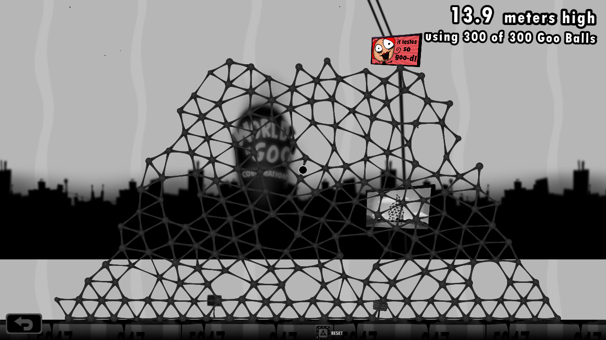

# Ralikwen — It's a tower

Competition entry.

Formal checks: admitted. This is not proof of execution, legality or reproducibility.

Authenticated submitting account: ralikwen (GitHub ID 7732368).

Platform submission time: 2026-09-14T16:02:31Z.

[Exact bundle manifest](../records/4a0751aa-384e-44c1-9578-ce1202c10319/submission.json) · [Publication receipt](../receipts/4a0751aa-384e-44c1-9578-ce1202c10319.json)

## Build instructions

- [Entry overview](../records/4a0751aa-384e-44c1-9578-ce1202c10319/readme.md)
- [Placement sequence](../records/4a0751aa-384e-44c1-9578-ce1202c10319/rebuild-steps.md)
- [Rebuilding guide](../records/4a0751aa-384e-44c1-9578-ce1202c10319/rebuild.md)
- [Starting setup](../records/4a0751aa-384e-44c1-9578-ce1202c10319/setup.md)

Claimed native height: 13\.9 m.

Creators (submitted attribution): Ralikwen.

## Discovery and building (self-declared)

Human and machine — including human oversight.

Ralikwen requested a stable tower using all 300 balls, initially suggested a broad rectangle, then suggested an equilateral triangular shape and straight aligned sides\. Ralikwen allowed legal missing connections to prioritize stability\. Codex selected the construction sequence, operated all native inputs\.

This is the submitter's claim, not independently verified by the platform. It does not change admission or height ranking.

## Recorded duration

| Phase | Wall seconds | Game seconds |
| --- | --- | --- |
| construction | 1594\.223293668 | 1594\.22 |
| hold | 300\.236038765 | 300\.22 |
| total | 1894\.459332433 | 1894\.44 |

Full structure in the native game, captured after reopening the unchanged completed save\. Only camera position and zoom were adjusted in an isolated viewing copy; no construction inputs\. The five-minute hold and height measurement belong to the original successful build\.

## Saved tower artifact

[Download save artifact](../records/4a0751aa-384e-44c1-9578-ce1202c10319/save/pers3.dat) — origin: game\_save.

SHA-256: a3706614a4b1f5018af45c04cf190eb6654e2329dc6dc52febfb185843771d8b.

Game version: 1\.6\.538; platform: Linux x86\_64 game through project-local Box64 on Linux ARM64, private Xvfb display.

Profile: Dedicated record-lab profile, slot 0, World of Goo Corporation\..

Restoration instructions (untrusted submitted data): With World of Goo 1\.6\.538 closed, use an isolated Linux test home, back up its \.WorldOfGoo/pers3\.dat if present, place the attached unchanged file at that path, launch the licensed game, select record-lab and open World of Goo Corporation\. The submitter ran the Linux x86\_64 version through Box64; no proprietary game assets are included\.

Capture and limitations: Written by the original game through its Back button after the final hold\. No subsequent construction\. Normal save-time movement and serialization rounding are possible\. Loading this file inspects the finished tower; start a separate legal build to repeat the construction\.

Presence is not proof of native validity, restorability, tower correspondence or legal construction.

## Note and tooling

Note: I learned that teaching AI is hard\.

Method: A broad native foundation followed by adaptive placement into low supported spaces and legal missing connections\. Every construction release used native game controls\. The single submitted image shows the full structure after reopening the unchanged completed save with camera-only viewing adjustments, disclosed in evidence/full-view\.json\.

Hardware: Linux ARM64 host running the licensed Linux x86\_64 World of Goo 1\.6\.538 binary through Box64, with a private Xvfb display\. Python scripts operated X11 inputs and observed native game state read-only\.

Preparation: Earlier native trials informed the adaptive controller and pickup recovery\. The supplied log records only the successful continuous build from the disclosed native three-ball triangle plus 297 loose balls\. No finished construction was injected during the build\.

## Attributed reproduction reports

No reproduction verdicts reported for this exact manifest.
